# 1. 项目概述
## 1.1 项目名称

**Porta**， 中文名称 **XXX**

## 1.2 项目目标
开发一个基于 LibP2P 的网络应用，通过构建点对点的安全隧道，通过定制化类浏览器界面，实现远端服务安全访问。

## 1.3 核心价值
**安全性**：利用 LibP2P 构建端到端加密隧道
**易用性**：将复杂的网络隧道配置简化为可视化操作
**灵活性**：支持多种运行模式和访问方式

## 术语说明
**Porta网络**: 该应用部署应用后整个系统的总称（涵盖所有节点，服务，隧道连接）。
**节点（Node）**： Porta 网络中的一个应用实例的统称， 其类型包括：边缘节点和社区节点。
**边缘节点（EdgeNode）**： Porta 网络中的一种应用实例， 可以注册本地的服务供其他节点访问，也可通过建立隧道连接访问其他节点的服务。
**社区/社区节点（CommunityNode）**：Porta 网络中的一种应用实例， 该节点提供p2p连接中转和代理功能，方便一些位于NAT后的节点之间建立p2p连接； 同时， 社区节点提供服务公告板、服务查询、节点查询、路由查询等相关功能，方便节点间进行高效信息分享。

 

# 2. 功能需求

## 2.1 节点基础功能概述
节点统一属性和功能，适用于 EdgeNode 和 CommunityNode。

### 2.1.1 节点配置
配置本地节点的一些基本信息，包括节点名字， key文件（生成节点唯一libp2p 的PeerID 和UUID）， Libp2p HOST监听端口， 防火墙外部监听地址设置等（用于地址分发）。

UI原型：
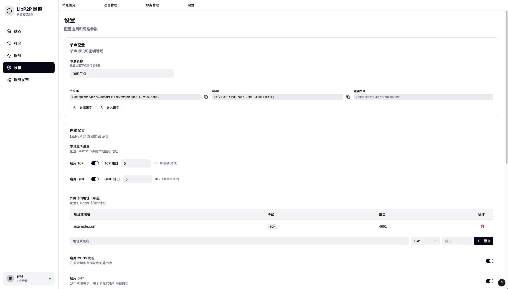

### 2.1.2 添加社区节点
EdgeNode 和CommunityNode 都可以维护一个社区节点信息列表， 用于中转连接和信息共享。 通过指定外部社区的Multiaddr（或基于该方法的其他衍生方法，如扫描二维码， UUID查询， Peer ID 查询等），添加外部CommunityNode节点 到本地节点记录中。

UI原型：

### 2.1.3 社区节点连接
通过libp2p连接到社区节点， 支持多种p2p协议，实现节点注册与发现、路由中转、服务注册与发现等业务功能。

## 2.2 服务定义
在Porta 网络中，服务用来描述节点提供的能力，供其他节点访问或使用。主要包括以下内容：
1.  **UUID**： 定义服务的唯一全局唯一ID（采用UUID），用于信息传送、交换、存储中表示服务
2.  **Name**： 服务的名称，人类可读
3.  **Protocol**: 服务的协议类型，指导使用侧如何使用该服务。支持类别包括：
     - http（含https）： WEB服务
     - tcp： 通用TCP服务
     - udp：通用UDP服务
     - omega： http代理服务
     - ws： WEB Socket
4. **Port**： 服务连接端口
5. **Description**： 服务描述
6. **NodeId**： 该服务的提供者的Node ID，用于指导p2p连接
7. **Others...**: 其他定义

## 2.3 节点业务功能概述

### 2.3.1 服务发现
边缘节点从连接的社区节点处获取其他节点注册的服务。

**前端**：基于社区表，提供获取特定社区注册服务列表，并提供 `订阅`操作
UI原型：
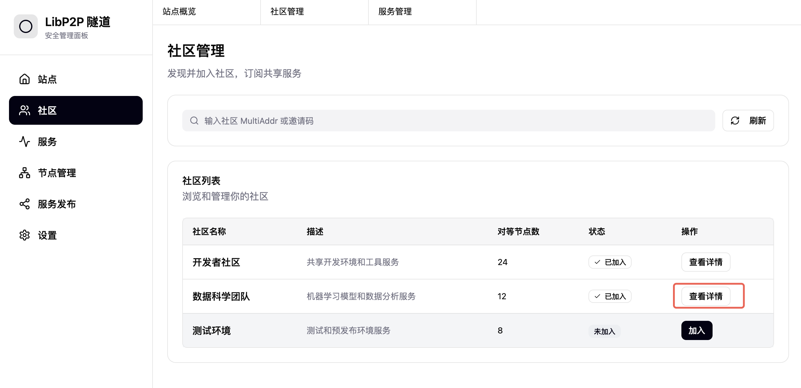
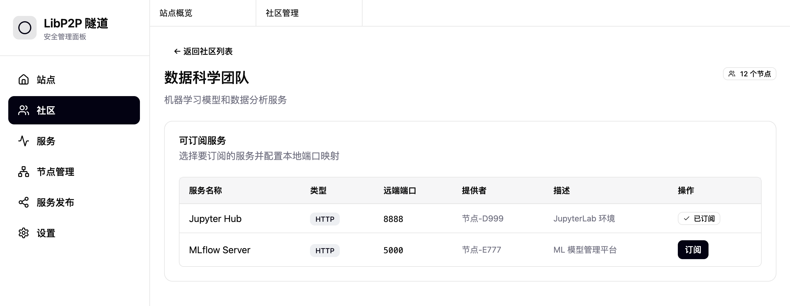

**后端**：需要基于libp2p 实现 `服务注册`, `服务查询` 相关管理协议

### 2.3.2 服务订阅
边缘节点从社区节点处获取到其他节点注册的服务列表后，可以选择感兴趣的服务进行 `订阅`。 订阅后，该服务基础信息会记录到当前节点的 `服务订阅表` 中。

UI原型：
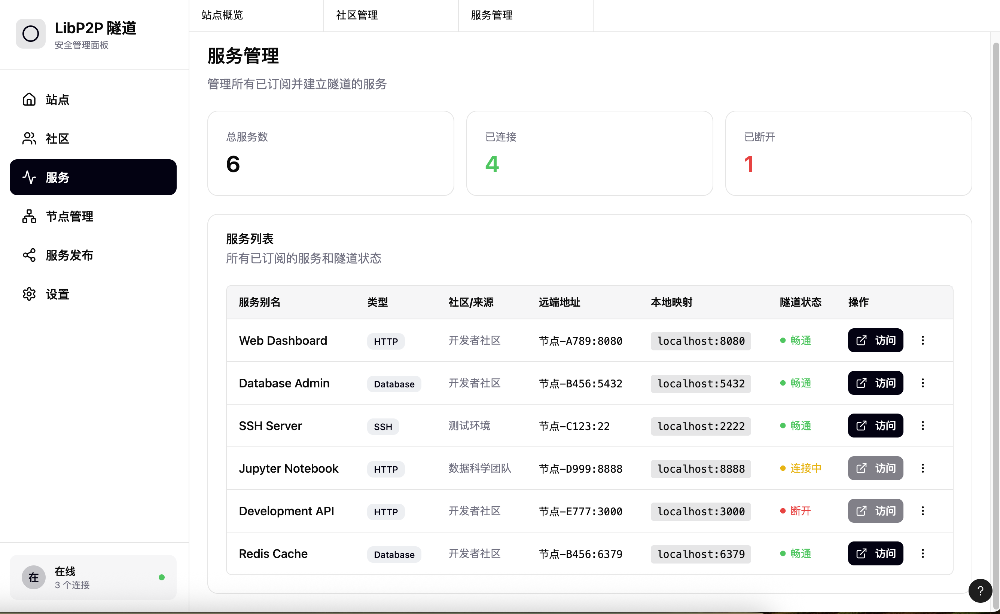

### 2.3.3 服务连接与访问
对订阅服务发起 `连接` 操作，构建当前节点到目标节点的 p2p 隧道； 构建成功后，执行连接（注意session管理）。

**前端**： 提供连接操作和相关管理入口和状态信息显示；对于已连接的服务，提供`访问` 按钮， 可以基于该服务隧道 创建数据流（libp2p 的stream）， 进行服务访问。 特别的，如果是http/https 类型服务，执行端口映射到本地， 并打开新的WEB标签，访问该映射端口，并展示内容。

UI原型：
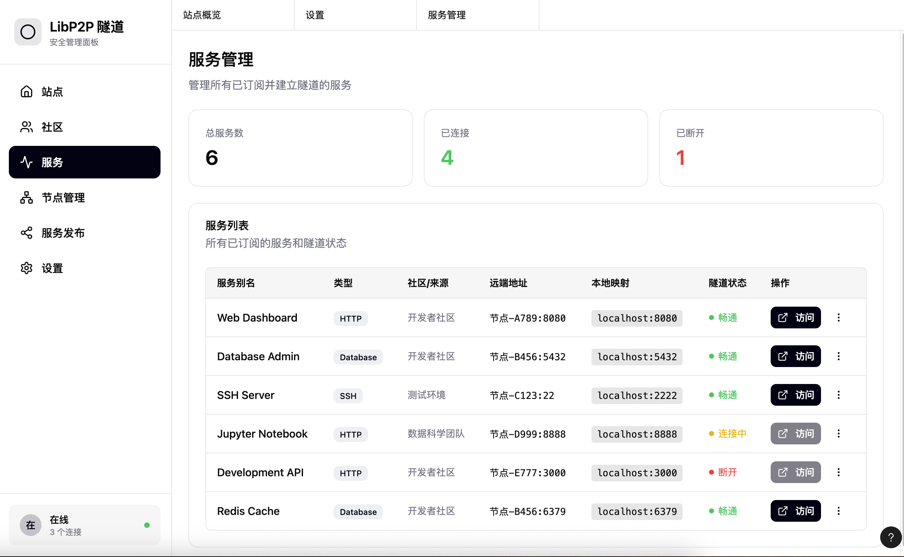
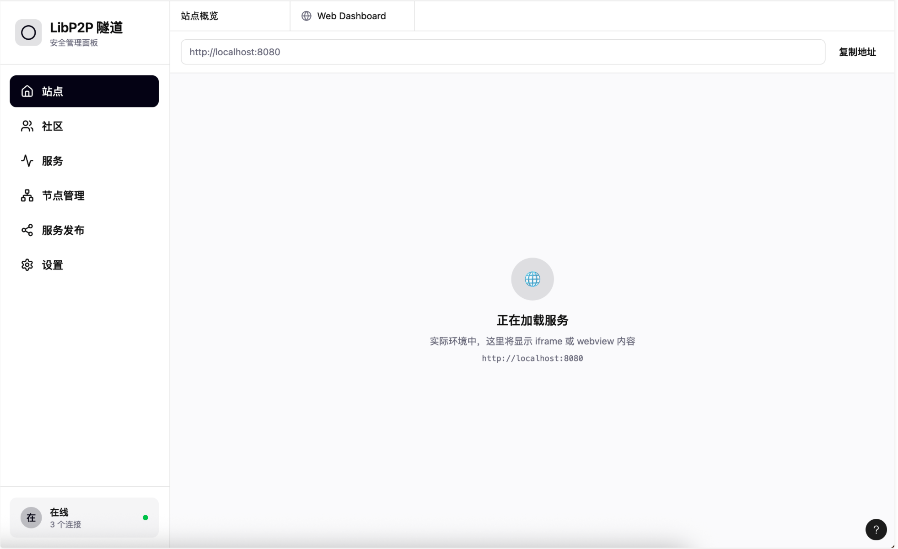

**后端**：需要实现隧道基于libp2p的节点连接，并提供端口映射功能， 和基于stream 的连接管理能力。

### 2.3.4 服务发布
节点可以将本地服务发布到 Porta网络中，供其他节点订阅。

**前端**： 提供本地已发布服务的列表展示和对应的操作管理（下架，删除等）； 提供新增服务发布相关操作管理。
UI原型：
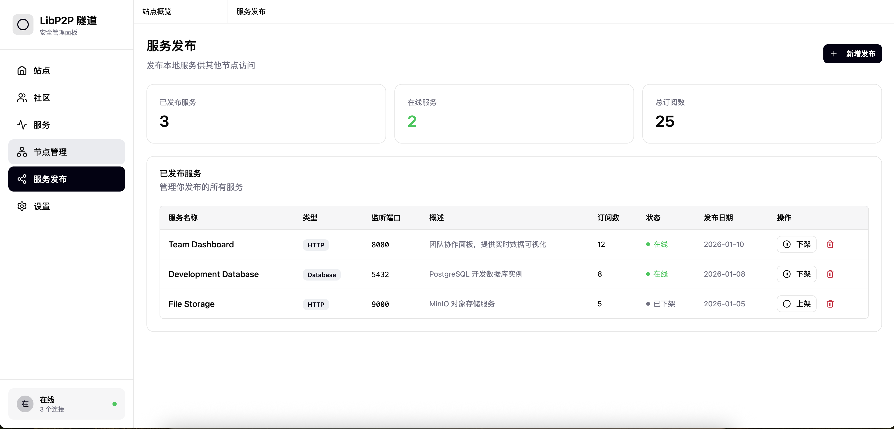

**后端**： 需要实现服务注册发布的libp2p协议， CommunityNode 需要实现服务注册登记相关功能。

### 2.3.5 服务管理
社区节点对注册到本节点的服务进行公告管理。对于处于公告状态中的节点， 用于其他节点通过服务查询获取到对应的服务信息（服务发现的主要方式）。 反之，如果公告状态被禁止， 则其他节点查询服务时， 不会返回当前服务的信息（不被节点感知）。

UI原型：
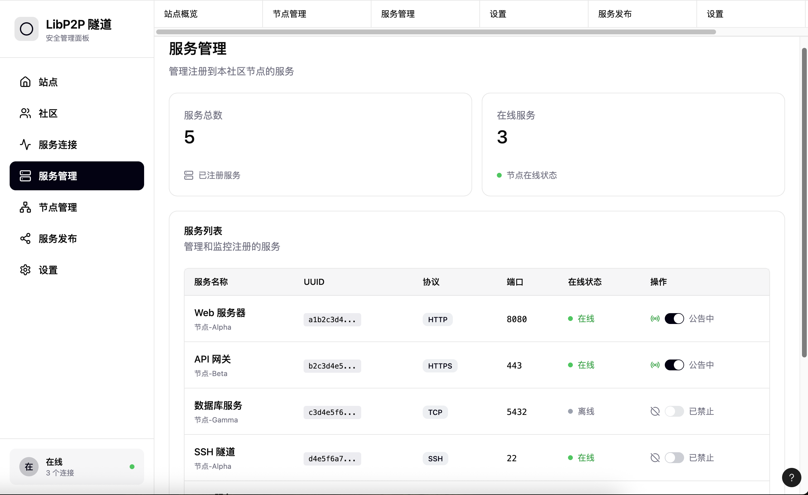

### 2.3.6 节点管理
社区节点对注册到本节点的边缘节点进行管理。可以封禁和解封节点。 被封禁的节点，不永许连接到当前节点，也不会转发去往当前节点的路由和代理连接。

UI原型：
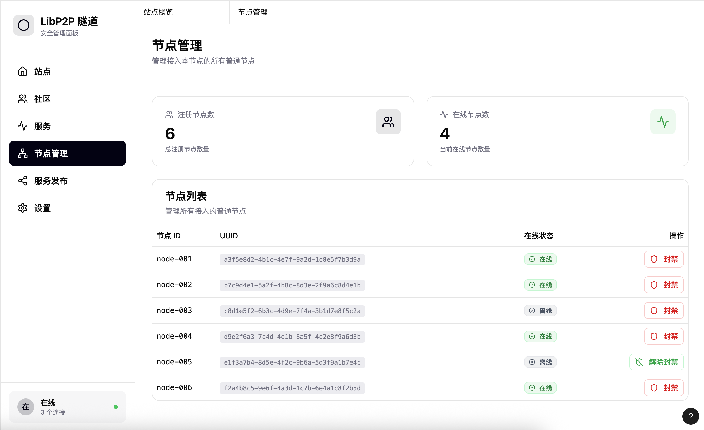

## 2.4 核心隧道功能

### 2.4.2 隧道建立

1. 所有社区节点应该配置有公网访问的IP 或域名， 边缘节点能够与社区节点直接建立 libp2p连接。
2. 边缘节点与边缘节点之间，采用基于共同社区节点代理的连接模式，且该代理模式需要支持hole punch 升级为直连模式。
3. 所有连接均启用 nose 和tls 安全连接。

### 2.4.2 服务映射
服务映射， 内网EdgeNode1 启动本地服务（如 tcp/8080) 并注册到CommunityNode 的服务列表中；内网EdgeNode2，通过CommunityNode提供的服务查询接口，获取到该服务的描述（PeerId， 服务协议，服务端口等）；EdgeNode2通过p2p连接到EdgeNode1， 并开启本地端口监听（如10000， 该端口即为EdgeNode1 在EdgeNode2上的映射端口）；当用户通过10000端口访问时，该连接被映射为 EdgeNode2与EdgeNode1 p2p连接上的一个stream进行转发，最终由EdgeNode1 的8080端口服务进行应答。

服务映射的模型如下：
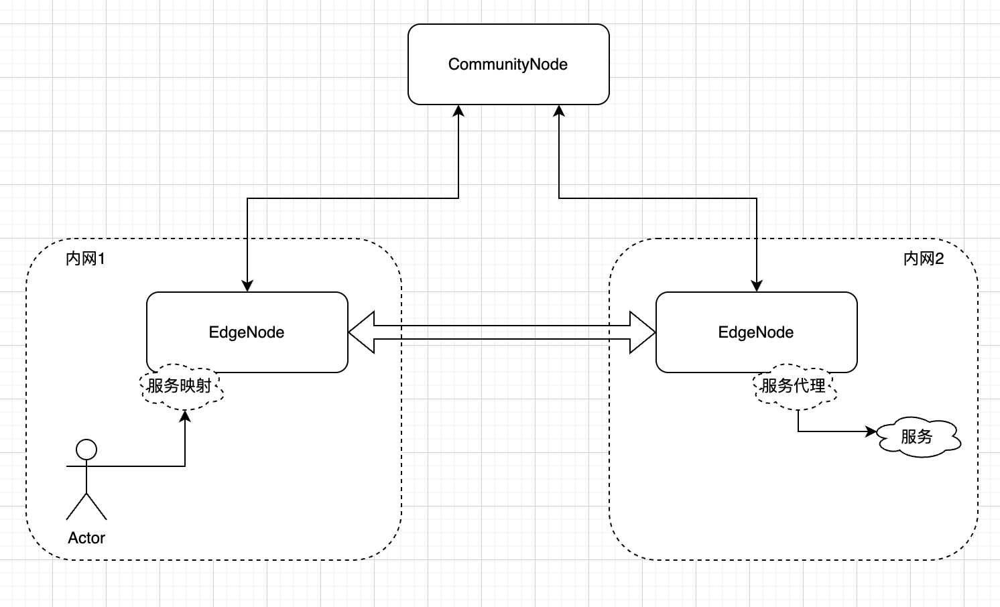

### 2.4.3 安全服务映射
安全服务映射和服务映射类似，核心功能是将远端节点的服务端口，映射到本地端口上，进行本地访问。
核心差异在于：
安全服务映射，不是直接连接到服务节点，而是需要经过至少两个中间节点的代理转发。
安全服务映射的模型如下：
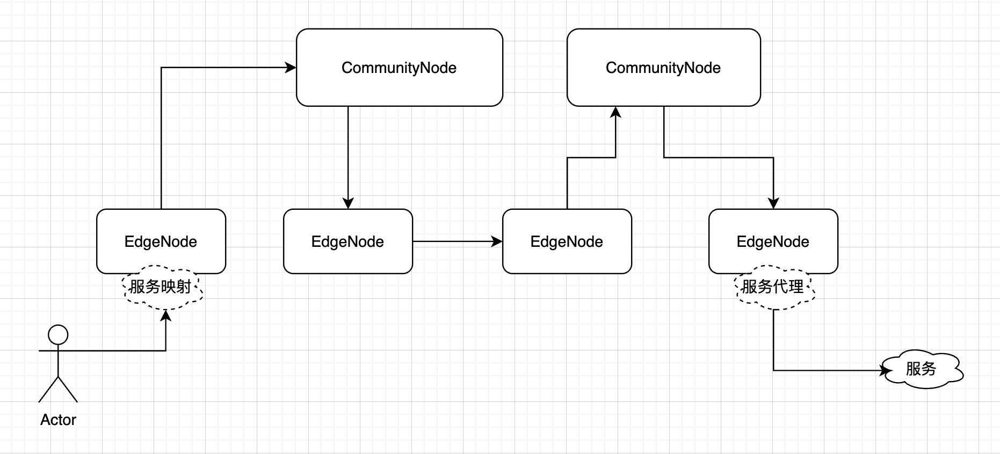

注意： 模型示意图中， CommunityNode 可能是同一个， 如果访问节点和服务节点都在同一个社区下。

## 2.5 Omega代理
是所有节点都具备的能力：监听一个本地端口， 用于对本地环境中的http请求进行代理访问。支持代理协议包括http、https、sock4、sock5。 可以配合传统浏览器的代理插件（如 ZeroOmega）使用。

节点通过配置可以启动或关闭该功能（默认启动）。

节点启动Omega代理后，会作为服务公布到Porta网络中，供其他节点映射后使用。 

# 3. 用户界面功能
见第2章中UI原型。

# 4. 运行模式

支持两种运行模型：**GUI应用模式** 和 **服务模式**。
这两种模式都采用统一的一套vue + TS的前端页面； 通过配置文件或启动参数进行运行模式控制（如 porta -b -p 8090, -b 参数表示运行在服务模式，通过8090提供WEB管理）。

## 4.1 GUI 应用模式

* 启动完整的桌面应用程序界面
* 支持系统托盘、全局快捷键等桌面特性
* 提供原生应用体验

## 4.2 后台服务模式

* 不启动图形界面，作为后台服务运行
* 提供标准的 HTTP API 接口
* 可通过 Web 浏览器访问完整的管理界面
* 支持系统服务方式部署

# 5. 跨平台要求

* 支持 Windows、macOS、Linux 主流桌面操作系统
* 相同的功能在不同平台上保持一致
* 适配不同操作系统的用户交互习惯

# 6. 非功能需求
## 6.1 性能要求
* 隧道建立时间：< 3秒
* 服务列表加载时间：< 1秒
* 支持并发建立多个隧道连接
* 内存占用合理，长时间运行稳定
* 支持心跳保活，断连重连等，保障服务稳定

## 6.2  可用性要求
* 界面操作直观，学习成本低
* 关键操作有确认提示
* 错误信息清晰明确
* 提供操作引导和帮助信息

## 6.3  安全性要求
* 所有隧道连接必须加密
* 本地配置数据安全存储， 尽量避免敏感信息存储（地址信息）， 如果必须存储，需要脱密处理
* 网络通信防止中间人攻击
* 访问权限控制

## 6.4 兼容性要求
* 支持主流现代浏览器内核（WebView）
* 向后兼容已有的 LibP2P 协议版本
* 配置数据可导出/导入

# 7. 技术约束
## 7.1 必须采用的技术
* LibP2P：作为底层网络通信框架
* Rust：核心业务逻辑和隧道实现
* Web 技术：Vue+JS+ElementPlus，用户界面渲染（HTML/CSS/JavaScript）。注意，所有界面资源必须下载到本地，进行编译打包，不要使用任何在线资源，确保应用在无公网环境下正常运行。

## 7.2 前端技术架构需求
1. 主应用采用单页面应用（SPA）架构，实现流畅的用户交互体验
2. 对于特定页面（如落地页、SEO关键页）支持完整页面渲染
3. 具备服务端渲染能力，平衡首屏性能和SEO需求
4. 支持混合路由模式，可根据业务需求灵活配置
5. 需要支持传统多页面应用（MPA），以支持映射服务在本地访问显示

# 8. 部署要求
* 支持生成单个可执行文件
* 支持安装包形式分发
* 支持系统服务方式安装
* 配置文件路径符合各平台规范

# 9. 验收标准
## 9.1 功能验收
1. 能够成功建立 LibP2P 安全隧道
2. HTTP 服务可通过本地端口正常访问
3. 代理服务可正确转发流量
4. 界面所有功能按钮操作正常
5. 后台模式可通过 Web 访问完整功能

## 9.2 兼容性验收
1. 在 Windows 10/11 上正常运行
2. 在 macOS 最新两个版本上正常运行
3. 在 Ubuntu LTS 版本上正常运行
4. 界面在 Chrome/Firefox/Safari 最新版本显示正常
